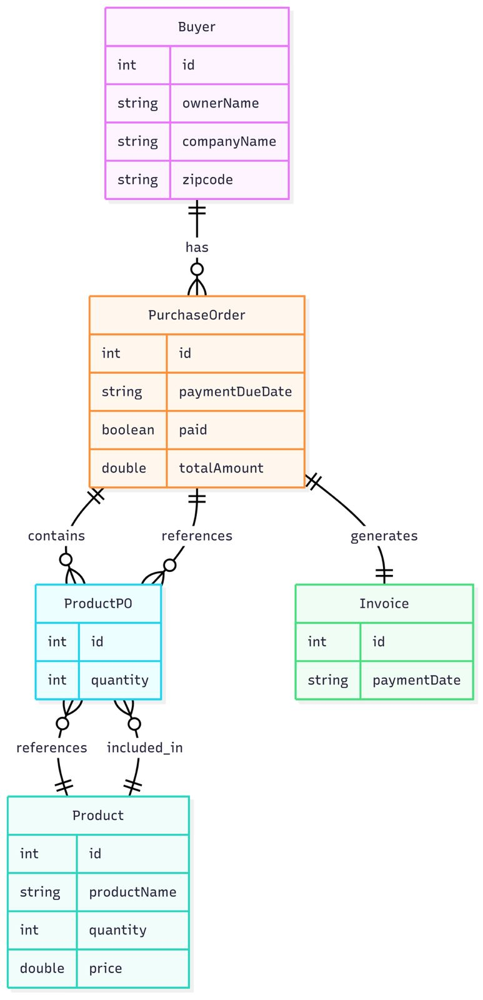

# 📌 Milestone 1 - Group 7

---

## 📦 Project Topic:
**Inventory Management System**

---

## 📝 Problem Statement

In today’s fast-paced business environment, organizations must efficiently manage their inventory to ensure smooth operations, minimize costs, and meet customer demands. Traditional manual inventory management methods are often error-prone, time-consuming, and lack real-time visibility, leading to issues such as stockouts, overstocking, delayed order processing, and inaccurate record-keeping. These inefficiencies can result in lost sales, increased operational costs, and poor customer satisfaction. Furthermore, managing related business processes such as employee and buyer information, purchase orders, and invoice generation adds complexity and increases the risk of data inconsistencies and miscommunication between departments.

To address these challenges, the Inventory Management System provides a comprehensive, web-based solution that automates and integrates all aspects of inventory control and related business operations. The system allows users to seamlessly add, update, and track products, manage buyer and employee records, process purchase orders, and generate invoices, all from a unified interface. Real-time data synchronization ensures that inventory levels and order statuses are always up-to-date, enabling timely decision-making and reducing the risk of errors. The application also incorporates features such as secure authentication, automated notifications for critical events (e.g., low stock alerts), and the ability to generate professional PDF invoices. By streamlining workflows and centralizing data, the system enhances operational efficiency, supports scalability, and empowers organizations to respond quickly to changing business needs.

---

## 🔧 Design Patterns to be Implemented

| Design Pattern     | Purpose / Use Case                                                                 |
|--------------------|-------------------------------------------------------------------------------------|
| **Command**        | Encapsulate tasks as objects, useful for undo/redo operations or action queuing    |
| **Decorator**      | Dynamically add features to products or carts (e.g., discount feature)             |
| **Facade**         | Provide unified access to subsystems (e.g., PDF generation, messaging)             |
| **Factory**        | Create various product or communication objects flexibly                           |
| **Observer**       | Implement stock alert system and buyer notifications                               |
| **State**          | Manage inventory status (in-stock, low-stock, out-of-stock) with state-specific behavior |
| **Strategy**       | Allow different strategies for buyer, employee, product, invoice handling          |

---

## ⚙️ Tech Stack

- **Backend:** Java, Spring Boot
- **Frontend:** React.js 
- **Database:** MySQL
- **Authentication:** Spring Security, JWT
- **PDF Generation:** iTextPDF
- **Email Notifications:** JavaMailSender
- **Tools:** Swagger, Postman, Docker, GitHub

---

## 🚀 Functionalities Planned for Milestone 2

### 🔐 User Authentication & Access Control
- Secure login for Admin and Employee roles
- Role-based access control (RBAC)

### 🧾 Entity Management (CRUD Operations)
- Products
- Buyers
- Employees

### 📦 Inventory & Order Management
- Stock level tracking and updates
- Purchase order creation and status management

### 🧾 Document & Communication Handling
- PDF invoice generation and download
- Email notifications for:
  - Order confirmations
  - Low stock alerts

### 📊 Dashboards & Monitoring
- Role-based dashboard with analytics

### 🔌 API Development & Testing
- RESTful API development with Swagger documentation
- Unit and integration testing

---

## 🗂️ UML/ER Diagram

> The UML diagram showcases the main entities: Product, Order, Buyer, Employee, and Invoice, along with their relationships.

---

## 👥 Contributions

| Member Name       | Contribution Description                                               |
|-------------------|------------------------------------------------------------------------|
| Rudra Patel     | Wrote the problem statement, finalized design pattern mapping to use cases, and formatted the milestone documentation.       |
| Janaki Rama Raju Vadapalli   | Designed and created the UML/ER diagram based on the database schema and relationships.                  |
| Smit Patel     | Organized the tech stack section, listed out planned functionalities for Milestone 2.  |
| Omkar Nate     | Defined and validated the entity relationships in code, ensured ER diagram compliance.   |
| Dhruv Baraiya     | Compiled team contributions and verified milestone formatting. |

---

